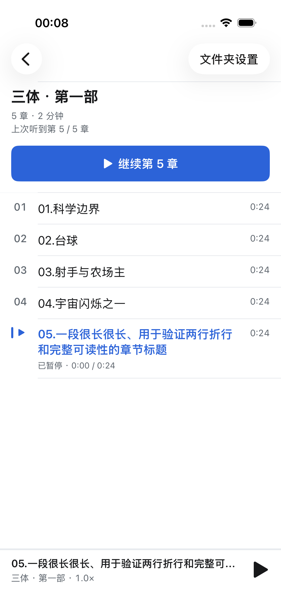

<div align="center">


# Mono

**一个安静的本地有声书播放器 · iOS & Android**

</div>

---

Mono 只做一件事：播放你已经拥有的音频文件。没有账号，没有书城，没有推荐流，也不联网——把音频文件夹拷进设备，它就按「一个文件夹 = 一本书，一个文件 = 一章」的方式列出来，记住你听到哪儿，然后让开。功能范围是刻意收窄的：不管理内容，不解析元数据，不显示封面。

如果你需要的是订阅制的有声书平台，或者播客客户端，这个项目不适合你。

## 平台状态

| 平台 | 技术栈 | 最低版本 | 状态 |
|------|--------|----------|------|
| iOS | Swift 5 · UIKit（纯代码） | iOS 18.2 | 主力实现，下列功能均已完成 |
| Android | Kotlin · Jetpack Compose · Media3 | Android 8.0（API 26） | 仅核心播放，功能明显落后于 iOS |

两端是独立实现，不共享代码。项目未上架 App Store 或 Google Play，需自行从源码构建。

## 功能

两端都具备的能力：

- **二级目录库**：扫描一层文件夹，文件夹即书，其中的音频文件即章节
- **自然排序**：`01` → `02` → `10`，而不是字典序的 `01` → `10` → `02`
- **九档变速**：0.5× / 0.75× / 1.0× / 1.25× / 1.5× / 1.75× / 2.0× / 2.5× / 3.0×，选择会被记住
- **断点续播**：重新打开后可从最近一次已保存的位置继续（Android 播放中尚未周期存档）
- **后台播放**：锁屏与控制中心／通知栏控制，拔耳机自动暂停
- **自动续章**：一章放完自动接下一章，到本书最后一章停止
- **删除管理**：可删除单章或整本

目前仅 iOS 具备的能力：

- **搜索**：按书名筛选书库（不匹配章节名）
- **设置页**：默认跳过设置、启动自动播放开关、清除全部收听进度
- **睡眠定时**：15 / 30 / 45 / 60 / 90 分钟、自定义时长（上限 24 小时），或「播完本章」；结束前 30 秒渐弱
- **跳过片头 / 片尾**：可设全局默认值，也可按单本书覆盖；跳片尾会直接进入下一章
- **逐章进度记忆**：每一章各自记住播放位置，并记住每本书最后听的那一章
- **无障碍**：动态字体（含辅助功能超大字号下的布局重排）、VoiceOver 标签与焦点管理、减弱动效

Android 端目前没有搜索、设置页、睡眠定时和跳过片头片尾；进度只保存全局的「最后一个音频 + 位置」单条记录，切换书籍会覆盖。详见 [MonoAndroid/README.md](MonoAndroid/README.md)。

两端运行时界面均跟随系统深色模式；Android 启动窗口仍是浅色，这是当前已知问题。全部文案为简体中文硬编码，尚未做多语言。

## 截图

<div align="center">

| 书库 | 章节 |
|:---:|:---:|
|  |  |
| **播放器** | **深色 + 超大字号** |
|  |  |

</div>

## 仓库结构

```
Mono/
├── MonoiOS/                  # iOS 应用
│   ├── Mono/                 # 源码
│   └── Mono.xcodeproj/
├── MonoAndroid/              # Android 应用
│   ├── app/src/main/         # 源码与资源
│   └── gradle/               # Gradle wrapper
├── UIRes/                    # 跨端共享的图标源文件
└── docs/
    ├── ARCHITECTURE.md       # 架构说明
    └── screenshots/          # 上方截图
```

## 构建

### iOS

需要 macOS、Xcode 16.2 或更高版本（部署目标 iOS 18.2）。无第三方依赖，无需 CocoaPods 或 SPM 拉取。

```bash
open MonoiOS/Mono.xcodeproj
```

或直接命令行构建：

```bash
xcodebuild -project MonoiOS/Mono.xcodeproj -scheme Mono \
  -destination 'generic/platform=iOS Simulator' build
```

装到真机需要在 Xcode 的 Signing & Capabilities 中换成你自己的开发者账号。

### Android

需要 JDK 17 与 Android SDK 34。用 Android Studio 打开 `MonoAndroid/`，或者：

```bash
cd MonoAndroid
./gradlew assembleDebug
```

SDK 路径通过环境变量 `ANDROID_HOME` 指定，或在 `MonoAndroid/local.properties` 里写 `sdk.dir=/path/to/sdk`（该文件不纳入版本管理）。

## 导入音频

Mono 不内置下载或转码，音频需要你自己放进设备。两端都要求**二级目录结构**：

```
书名/
├── 01 第一章.mp3
├── 02 第二章.mp3
└── 03 第三章.mp3
```

书籍文件夹内不会递归扫描子目录；散落在根目录、没有被文件夹包裹的音频文件不会出现在书库里。

**iOS**：用数据线连接 Mac，打开 Finder → 选中设备 → 文件 → 拖入 Mono，或在「文件」App 里放进 Mono 的文件夹。整个**文件夹**拖进去，不要只拖文件。

**Android**：把文件夹复制到设备的 `Music/Mono/` 目录（USB 文件传输或手机上的文件管理器均可）。该目录首次启动时会自动创建。

### 支持的格式

按扩展名白名单过滤，实际能否解码仍取决于系统编解码器：

| 扩展名 | iOS | Android |
|--------|:---:|:---:|
| `mp3` `m4a` `m4b` `wav` `aac` `flac` | ✅ | ✅ |
| `caf` | ✅ | — |
| `ogg` `wma` | — | ✅ |

Mono 只读取文件名和时长，不解析 ID3 标签、章节元数据或内嵌封面，界面上也不显示封面图。

## 隐私

Mono 是纯本地应用，这一点是可以从源码验证的：

- 不发起任何网络请求。iOS 端全部 import 只有 `UIKit` / `Foundation` / `AVFoundation` / `MediaPlayer`，无第三方依赖；Android 端未申请 `INTERNET` 权限，依赖全部来自 AndroidX、Compose 与 Media3。
- 无账号、无登录、无云同步、无埋点、无崩溃上报、无广告 SDK。
- 音频与收听进度只存在设备本地：iOS 在应用沙盒的 Documents 与 UserDefaults，Android 在 `Music/Mono/` 与 SharedPreferences。卸载即清除（Android 上位于公共目录的音频文件除外）。

## 更多文档

- [架构说明](docs/ARCHITECTURE.md) —— 跨端结构、数据与播放流转、持久化边界
- [iOS 开发说明](MonoiOS/README.md)
- [Android 开发说明](MonoAndroid/README.md)
- [贡献指南](CONTRIBUTING.md)

## 许可

[MIT](LICENSE) © 2026 heypandax

仓库中不包含任何音频内容。请只导入你自己合法拥有的文件。
