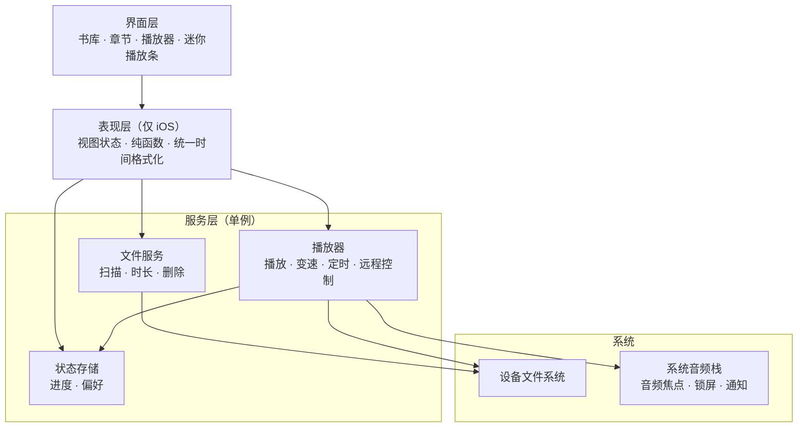

# 架构说明

这份文档描述 Mono 两端共同的结构模型、数据与播放流转，以及改代码时不能破坏的约束。平台细节见 [MonoiOS/README.md](../MonoiOS/README.md) 与 [MonoAndroid/README.md](../MonoAndroid/README.md)。

## 前提约束

四条产品前提决定了整个架构，改动前请先确认没有违反它们：

1. **纯本地**。不联网、无账号、无同步、无遥测。所有状态都在设备上。
2. **不管理内容**。App 不下载、不转码、不改写用户的文件，只读取和播放；唯一的写操作是删除。
3. **两级目录即数据模型**。文件夹 = 一本书，其中的音频文件 = 章节。没有数据库，文件系统本身就是书库。
4. **不解析元数据**。只用文件名和时长，不读 ID3、不读内嵌章节、不显示封面。

iOS 与 Android 是两套独立实现，不共享代码，也不追求功能对齐。两端唯一共享的是上面这个模型和 `UIRes/` 里的图标源文件。

## 分层

**服务层是唯一的可变全局状态**，三个职责各自一个单例：播放、文件、持久化。界面层不持有播放状态的副本，一律向播放器查询或订阅——这是避免「进度条和迷你播放条对不上」这类问题的根本约束。

**表现层目前只有 iOS 有**（`MonoiOS/Mono/Presentation/`）。它不依赖 UI 框架，把「播放器状态 + 存档状态 + 文件事实」折算成视图状态结构体，并统一所有时间／时长／倍速字符串的格式化。书库和搜索结果共用同一份书籍状态缓存，因此同一本书在两个列表里必然显示一致。Android 端没有这一层，界面直接读服务。

## 平台映射

| 概念 | iOS | Android |
|---|---|---|
| 播放引擎 | `AVPlayer` + `AVPlayerItem` | Media3 `ExoPlayer` |
| 播放宿主 | 单例 `AudioPlayerManager`（App 进程内） | `AudioPlaybackService`（`MediaSessionService` 前台服务） |
| 锁屏 / 通知控制 | `MPRemoteCommandCenter` + `MPNowPlayingInfoCenter` | `MediaSession` + Media3 默认媒体通知 |
| 音频焦点 / 中断 | 手动处理 `AVAudioSession` 中断与路由变化通知 | 交给 ExoPlayer（`handleAudioFocus` / `handleAudioBecomingNoisy`） |
| 文件扫描 | `FileService` on `FileManager` | `FileRepository` on `java.io.File` |
| 音频位置 | App 沙盒 `Documents/` | 公共存储 `Music/Mono/` |
| 时长读取 | `AVURLAsset.load(.duration)` | `MediaMetadataRetriever` |
| 持久化 | `UserDefaults` | `SharedPreferences`（`mono_prefs`） |
| 状态传播 | 弱引用多 delegate 表 | 界面定时轮询（200–500ms） |
| 界面 | UIKit 纯代码 | Jetpack Compose |

## 数据流

**扫描与展示**：界面请求书库 → 文件服务枚举音频根目录的第一层 → 过滤出「直接包含受支持音频文件」的目录 → 自然序排序 → 返回。时长不在这一步读取。

**时长回填**是异步的两阶段：列表先用文件名秒出，时长在后台线程读取后回填并缓存。**任何列表 UI 都必须能渲染「时长未知」这个中间态**，不能假设时长一定存在。iOS 把这份缓存落盘到 `Caches/`，Android 只放内存。

**播放**：界面把「这一章 + 它所在的整本书的章节数组」交给播放器 → 播放器加载、应用已存的倍速、按存档位置 seek → 状态经 delegate（iOS）或轮询（Android）回到界面 → 同时推送到锁屏与通知栏。

**存档**：位置写入的时机是两端最大的差别之一。iOS 在播放中每 30 秒、暂停时、seek 完成后、以及进入后台或失活时都写。Android 在暂停、服务销毁与 Activity 进入后台时写，但**播放过程中没有周期性存档**——进程在播放中被杀会丢掉上次暂停之后的进度。

**恢复**：两端启动时都会读取上次的音频与位置，加载并 seek 到位，但**默认都不自动开始播放**。iOS 提供了「启动时自动播放」开关来改变这个行为，Android 没有。

**删除**是物理删除，不可撤销：删文件 → 清理该范围的时长缓存 → 清理相关的进度记录 → 如果删的正是在播的内容则停止播放。任何删除入口都必须先弹确认。

## 持久化边界

| 数据 | iOS | Android | 卸载后 |
|---|---|---|---|
| 音频文件 | 沙盒 `Documents/` | 公共 `Music/Mono/` | iOS 清除；Android 保留 |
| 时长缓存 | `Caches/durationCache.json` | 仅内存 | 均可随时丢弃重建 |
| 播放进度与偏好 | `UserDefaults` | `SharedPreferences` | 均清除 |

**没有数据库**，两端都没有 Core Data / Room / SQLite，也没有任何迁移框架。这是刻意的：数据模型就是文件系统，键值存储只用来记住「听到哪儿」和几个开关。

进度记录的粒度两端不同，这是当前最实质的功能差异：

- **iOS** 有三个层级——全局「当前音频 + 位置」、按书的「最后听的那一章」与「该书的跳过设置」、按章的「这一章听到哪儿」。
- **Android** 只有一条全局记录（音频路径 + 位置 + 倍速），切换书籍即覆盖。

## 关键不变量

改动时请守住这些，它们各自对应过真实的 bug：

- **iOS 上文件路径必须以 Documents 相对路径持久化**。沙盒容器 UUID 每次安装都会变，存绝对路径会导致重装后进度全部失效。历史遗留的绝对路径按 `/Documents/` 切分迁移。
- **排序必须是数字感知的自然序**，不能用字典序，否则 `10` 会排到 `02` 前面。
- **书内不递归子目录**。库结构严格两级，深层目录不予展开。
- **时长可能为 0 或尚未读出**，UI 必须区分「时长为零」和「还没读到」，不能拿它做除法算进度条。
- **播放器是播放状态的唯一事实来源**，界面不缓存播放位置。
- **自动续章止于本书最后一章**，不跨书、不循环、不随机。
- **不要引入网络依赖**。这是产品前提，不是实现细节。
- iOS 上**所有时间与倍速字符串必须走 `MonoFormat`**，所有颜色与尺寸必须走 `DesignTokens`——前者保证多处显示一致，后者保证深色模式与动态字体自动生效。

## 当前的架构债务

诚实记录，避免误读为设计意图：

- Android 界面靠定时轮询获取播放状态（`notifyStateChanged()` 是空实现），应改为 `StateFlow`。
- Android 缺少表现层，格式化与状态折算散落在各 Composable 中，已经出现两处文案不一致。
- Android 的进度模型（单条全局记录）不足以支撑多本书并行收听。
- 两端都**没有自动化测试**，没有测试 target 或测试源集。回归目前完全依赖手动验证。
- 两端文案均为硬编码简体中文，未做本地化。
